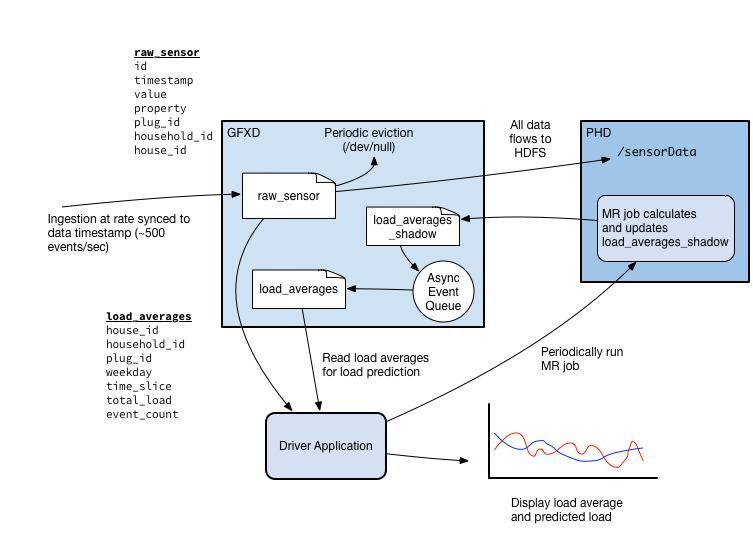
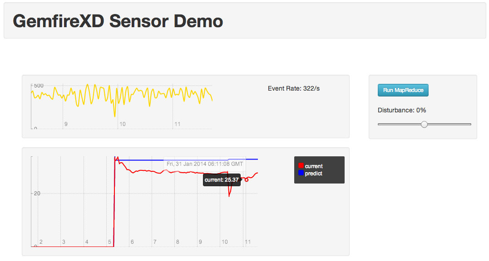
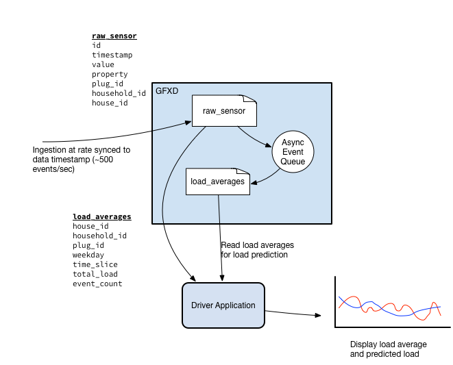

GemfireXD Sensor Demo
=====================

Background
----------

This demo is based on the [DEBS 2014 Challenge]. It uses the data set presented there and strives to achieve some of the objectives of the challenge.

The demo is intended to illustrate how time-series data may be ingested into GemFireXD, evicted to Hadoop/HDFS, processed there, and then have the results be fed back into GemFireXD.

Data Flow
---------

The following diagram illustrates the basic data flow:

----

Data is ingested from an external source into a table which is backed by a HDFS write-only store. As data is written, it is automatically also written out to HDFS.

A MapReduce job performs computation on the HDFS data in order to calculate load averages. The results are fed back into GemFireXD using a table which has an Async Event listener associated with it. The listener is then responsible for updating the load averages which are eventually used to compute prediction values.

Although the MapReduce job could directly update the load averages, the Async Event listener component is simply reused so as not to duplicate functionality. (The Async Event listener can be used to provide the same functionality as the MapReduce job in the event that Hadoop is not available).

----

Schema
------

Only two primary tables are used by the demo. One is used to hold incoming sensor data (`raw_sensor`) and the other is used to hold load average data used for load prediction (`load_averages`). Both tables are partitioned by `house_id` and are colocated.

    -- raw_sensor table

    id           bigint
    timestamp    bigint
    value        float(23)
    property     smallint
    plug_id      integer
    household_id integer
    house_id     integer
    weekday      smallint
    time_slice   smallint

    -- load_averages table

    house_id     integer
    household_id integer
    plug_id      integer
    weekday      smallint
    time_slice   smallint
    total_load   float(23)
    event_count  integer

Although sensor data is recorded per second, the smallest aggregation is 5 minutes, thus each row in `load_averages` represents the average load for a given 5-minute slice, per weekday, per unique plug. Slices are numbered 0-287.

As data is constantly streaming in, the `raw_sensor` table can only hold a certain amount of in-memory or operational data. In order that the data does not overflow memory, old data is evicted with an eviction clause:

    eviction by criteria (expired(timestamp, 600) = 1)
    eviction frequency 600 seconds

Here a function called `expired` is being called every 10 minutes in order to evict data which is older than 10 minutes.

The schema also defines the HDFS store used by the `raw_sensor` table to stream data to Hadoop, which will later be used by the MapReduce job. 

    CREATE HDFSSTORE sensorStore
      NameNode 'hdfs://localhost:9000'
      HomeDir '/sensorStore'
      BatchSize 10
      BatchTimeInterval 2000

The `load_averages_shadow` table is used as the destination for the MapReduce job output. The inserted rows are processed by the attached Async Event Listener and used to update the `load_averages` table.

Data
----

Unfortunately the original data provided for this challenge is very large and unwieldy. Included with the source for this demo is pre-computed load_averages data for only 10 houses (approximately 500 plugs) and a much smaller (2 million entries) subset of the original sensor data set. A larger set of data (100 million rows) can be found on the [DEBS 2014 Challenge] site.

For this demo, we are only interested in the _load_ events (where `property == 1`), thus the provided data file only contains these events.

The following changes are applied to the events as they are read in:

* The timestamp is adjusted to match the current time
* A system-wide unique `plug_id` is generated. This allows for faster updates to the `load_averages` data as well as reducing the size of indexes.

Structure
---------

The repo consists of 4 sub-projects:

* `gfxd-demo-loader` - The loader which used to stream events into the system.
* `gfxd-demo-mapreduce` - The MapReduce component which produces load prediction data.
* `gfxd-demo-web` - The web UI component.
* `gfxd-demo-aeq-listener` - An AsyncEventQueue component which can serve the same purpose as the MapReduce part. Use this if you don't have Hadoop.

Building
--------

The demo is built using Gradle which is bundled.

You will need a release of GemFireXD - specifically the gemfirexd.jar and gemfirexd-client.jar files.

Create or edit `gradle.properties` in the source root directory defining the GFXD_HOME property which should point to your GemFireXD product directory. For example

    # gradle.properties file
    GFXD_HOME = /usr/lib/gphd/gfxd

Then simply build with:

    ./gradlew build

Running on Hadoop
-----------------

Running the demo involves 3 main phases, namely _setup_, _ingest_ and _mapreduce_.

Before starting, make sure that the provided data is uncompressed.

    gunzip data/*gz

### Hadoop

The demo is intended to be run using the Pivotal HD distribution. An easy way to do this is by using the [PHD VM]. 

Ensure that the namenode URL is set correctly in `scripts/schema-hadoop.sql`. For the PHD VM, this would be `hdfs://localhost:8020`

### Setup (for Hadoop)

The `gfxd-demo-aeq-listener-1.0.jar` file needs to be available on the GemFireXD classpath. When using the PHD VM, edit the `~/Desktop/start_gfxd.sh` script and adjust it as follows:

    # Look for the function 'startServers' and modify the gfxd server start, adding the -classpath and -server-groups options
    # Note that for some versions, this command may be sqlf and not gfxd. These commands are interchangeable.
    gfxd server start -dir=$BASEDIR/server${i} -locators=localhost[10101] -client-port=$CLIENTPORT \
        -server-groups=group1 \
        -classpath=/home/gpadmin/gfxd-demo/gfxd-demo-aeq-listener/build/libs/gfxd-demo-aeq-listener-1.0.jar

Restart the GemFireXD servers.

Also ensure that YARN is running. On the PHD VM, YARN can be explicitly started with:

    icm_client start -l pivhd -s yarn

The setup phase consists of creating the schema and populating the load_averages table. This step is achieved with:

    ./gradlew loadAverages

This task performs the following actions:
* Create the necessary tables, HDFS store definitions and Async Event listeners
* Import data into the `load_averages` table

### Ingest

This step starts up the web application which serves the UI as well as perfoming the ingestion. Run with:

    ./gradlew gfxd-demo-web:jettyRun -DloadFile=$PWD/data/sorted2M.csv -DconfigFile=$PWD/gfxd-demo-loader/config.properties

In order to see additional debug logging, also add the following to the previous command:

    -Dorg.slf4j.simpleLogger.defaultLogLevel=DEBUG

Initially, 5 minutes worth of sensor data will be consumed as quickly as possible and then the data will be ingested by the second. This is done to seed the operational data so that the prediction model will have data to work with. The UI can be accessed at `http://localhost:9090/ui/index.html`.

----

----

### Mapreduce 

Running MapReduce is not automatically scheduled, but can be run manually by the user. The UI provides a _Run MapReduce_ button which will perform the run. Output will appear on the console of the web server. Similarly, the job can also be initiated from the command line with:

    yarn jar $PWD/gfxd-demo-mapreduce/build/libs/gfxd-demo-mapreduce-1.0.jar

If necessary, the GemFireXD JDBC URL can be specified with:

    -Dgemfirexd.url="jdbc:gemfirexd://localhost:1527"

The job will generate entries on `load_averages` table, which will be used for prediction analysis.

If desired, the job can also be run with Gradle:

    ./gradlew gfxd-demo-mapreduce:run -Pargs=$PWD/gfxd-demo-mapreduce/build/libs/gfxd-demo-mapreduce-1.0.jar

Running without Hadoop
----------------------

If you do not have a PHD VM environment available, you can still run the demo and simulate the MapReduce functionality by using the Async Event listener component to perform the same functionality.

In this scenario, the architecture would look as follows:

If you are not using the PHD VM, you can start up a single GemFireXD server with:

    ./gradlew -Pflavor=aeq cycle

This will use a different DDL script (`scripts/schema-aeq.sql`) to set up the necessary tables.

If you are using the PHD VM and already have GemFireXD servers running, you can load the schema with:

    ./gradlew -Pflavor=aeq loadAverages

At this point, the ingestion can be run as described above.

[DEBS 2014 Challenge]:https://www.cse.iitb.ac.in/debs2014/?page_id=42
[PHD VM]:https://network.gopivotal.com/products/pivotal-hd

